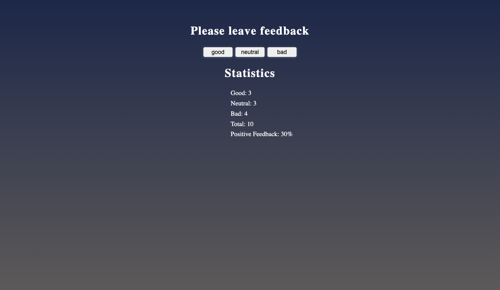

# Критерії приймання

- Створені репозиторії `goit-react-woolf-hw-02-feedback`.
- При здачі домашньої роботи є два посилання: на вихідні файли та робочі
  сторінки кожного завдання на `GitHub Pages`.
- Під час запуску коду завдання в консолі відсутні помилки та попередження.
- Для кожного компонента є окремий файл у папці `src/components`.
- Все, що компонент очікує у вигляді пропсів, передається йому під час виклику.
- JS-код чистий і зрозумілий, використовується `Prettier`.
- Стилізація виконана `CSS-модулями` або `Styled Components`.

# Віджет відгуків

Як і більшість компаній, кафе Expresso збирає відгуки від своїх клієнтів. Твоє
завдання – створити додаток для збору статистики. Є лише три варіанти зворотного
зв'язку: добре, нейтрально і погано.

## Крок 1

Застосунок повинен відображати кількість зібраних відгуків для кожної категорії.
Застосунок не повинен зберігати статистику відгуків між різними сесіями
(оновлення сторінки).

Стан застосунку обов'язково повинен бути наступного вигляду, додавати нові
властивості не можна.

```bash
state = {
  good: 0,
  neutral: 0,
  bad: 0
}
```

Інтерфейс може мати такий вигляд.


## Крок 2

Розшир функціонал застосунку таким чином, щоб в інтерфейсі відображалося більше
статистики про зібрані відгуки. Додай відображення загальної кількості зібраних
відгуків з усіх категорій та відсоток позитивних відгуків. Для цього створи
допоміжні методи `countTotalFeedback()` і `countPositiveFeedbackPercentage()`,
які підраховують ці значення, ґрунтуючись на даних у стані (обчислювані дані).


## Крок 3

Виконай рефакторинг застосунку. Стан застосунку повинен залишатися у кореневому
компоненті `<App>`.

- Винеси відображення статистики в окремий компонент
  `<Statistics good={} neutral={} bad={} total={} positivePercentage={}>`.
- Винеси блок кнопок в компонент
  `<FeedbackOptions options={} onLeaveFeedback={}>`.
- Створи компонент `<Section title="">`, який рендерить секцію із заголовком і
  дітей (children). Обгорни кожен із `<Statistics>` і `<FeedbackOptions>` у
  створений компонент секції.

## Крок 4

Розшир функціонал застосунку таким чином, щоб блок статистики рендерився тільки
після того, як було зібрано хоча б один відгук. Повідомлення про відсутність
статистики винеси в компонент `<Notification message="There is no feedback">`.


## Фінальний результат


